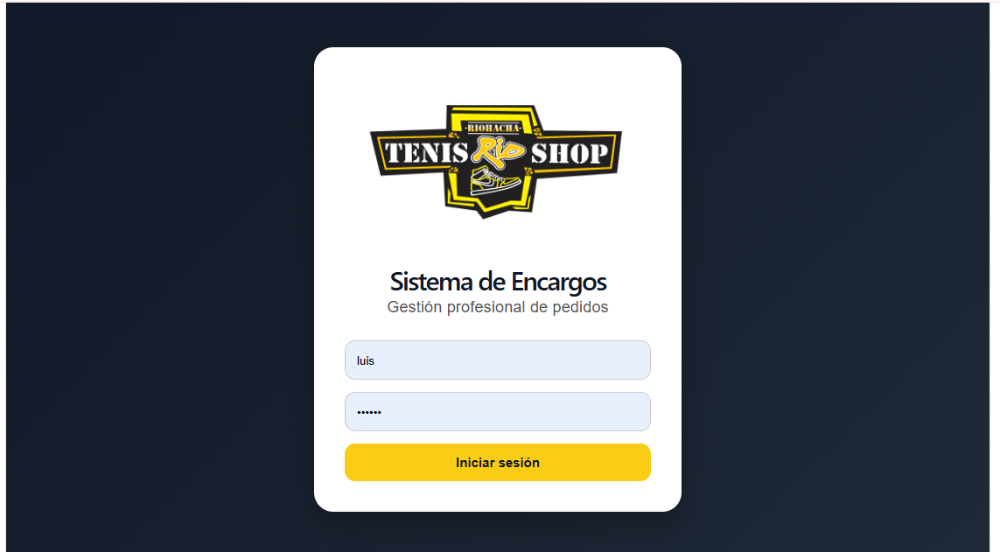
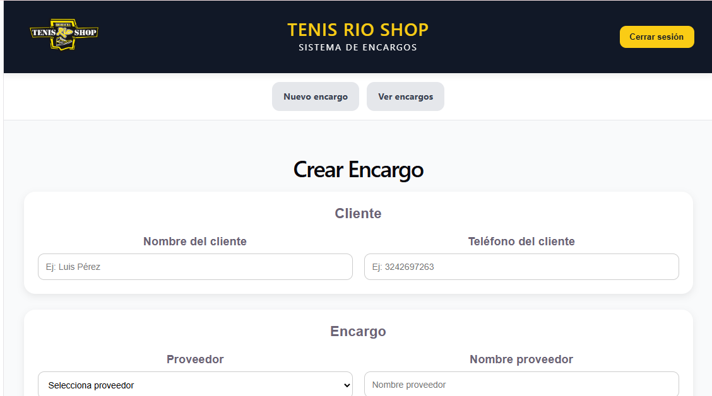
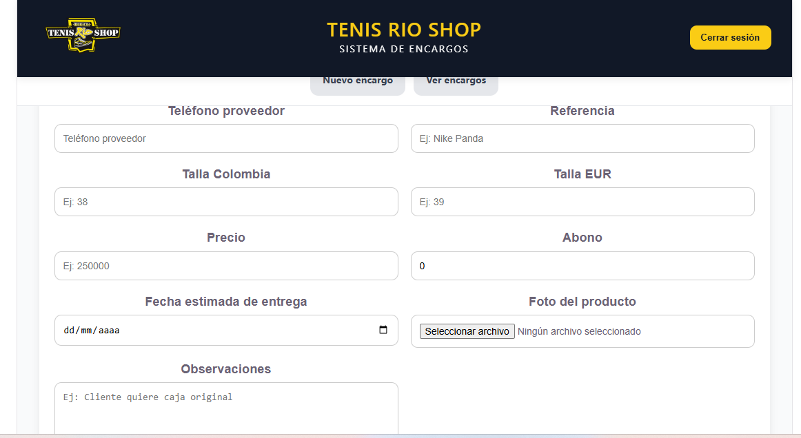
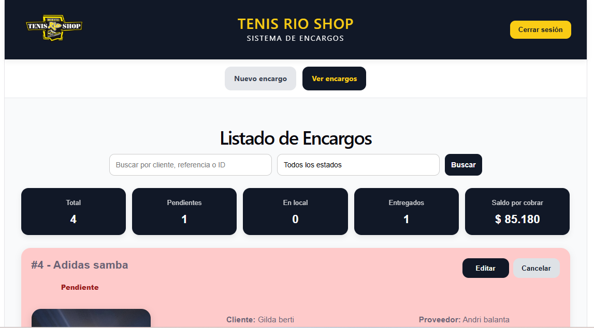

# Sistema de Encargos - TENISRioSHOP


Sistema web profesional desarrollado para la gestión de encargos, clientes y proveedores de TENISRioSHOP.

Proyecto real enfocado en automatización de procesos comerciales, integración de APIs y arquitectura full stack moderna.

---

# Demo en producción

Frontend:

https://encargos.tenisrioshop.com/login

Backend API:

https://sistema-encargos-tenis-rioshop-production.up.railway.app/docs

---

# Capturas del sistema

## Login



---

## Crear encargo



---

## Formulario avanzado



---

## Dashboard y listado de encargos



---

# Arquitectura del sistema

```text
Usuario / Empleado
        |
        v
Frontend React + TypeScript
        |
        v
API REST - FastAPI
        |
        v
PostgreSQL - Railway
        |
        +--> Cloudinary - almacenamiento de imágenes
        |
        +--> WhatsApp Cloud API - notificaciones automáticas
```

---

# Funcionalidades principales

- Gestión de clientes
- Gestión de proveedores
- Creación de encargos
- Edición de encargos
- Control de abonos y saldos
- Estados de pedidos
- Subida de imágenes
- Dashboard administrativo
- Filtros y búsqueda
- Integración con WhatsApp
- Diseño responsive
- Autenticación JWT
- API REST documentada con Swagger

---

# Tecnologías utilizadas

## Backend

- Python
- FastAPI
- SQLAlchemy
- PostgreSQL
- JWT Authentication
- Uvicorn
- Pydantic

## Frontend

- React
- TypeScript
- Vite
- CSS3

## Infraestructura y servicios

- Railway
- Cloudinary
- GitHub
- WhatsApp Cloud API

---

# Características técnicas

- Arquitectura cliente-servidor
- API RESTful
- Manejo de CORS
- Variables de entorno
- Deploy en producción
- Dominio personalizado
- Integración de servicios externos
- Upload de imágenes en la nube
- Validaciones backend
- Manejo de autenticación segura
- Base de datos relacional

---

# Estados del sistema

- Pendiente
- Pedido
- Despachado
- En local
- Entregado
- Cancelado

---

# Próximas mejoras

- Roles y permisos
- Inventario
- Dashboard avanzado
- Estadísticas de ventas
- Notificaciones en tiempo real
- Docker
- Tests automáticos
- CI/CD con GitHub Actions
- Pasarela de pagos
- Multiusuario

---

# Autor

## Luis Guillermo Perez Velandia

Backend Developer enfocado en Python, FastAPI, PostgreSQL, React y automatización de procesos mediante inteligencia artificial.

Actualmente desarrollando soluciones reales para negocio utilizando arquitectura full stack moderna e integración de APIs.

GitHub:

https://github.com/luisgperezv

LinkedIn:

https://www.linkedin.com/in/luis-guillermo-perez-dev